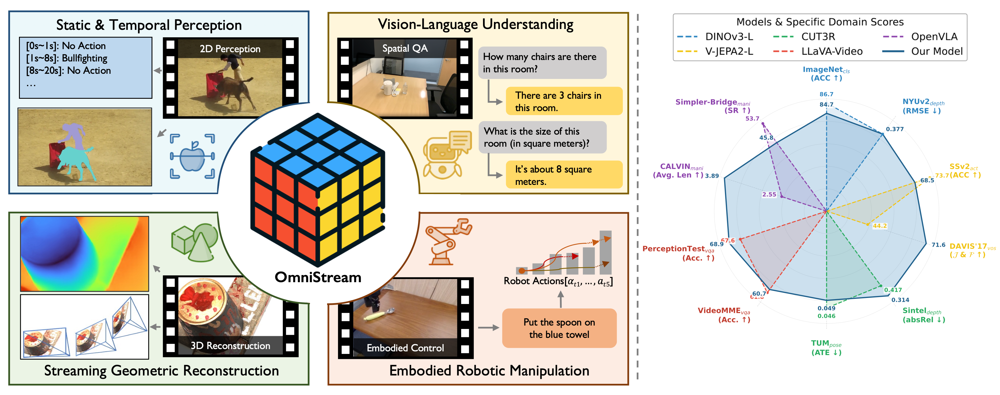
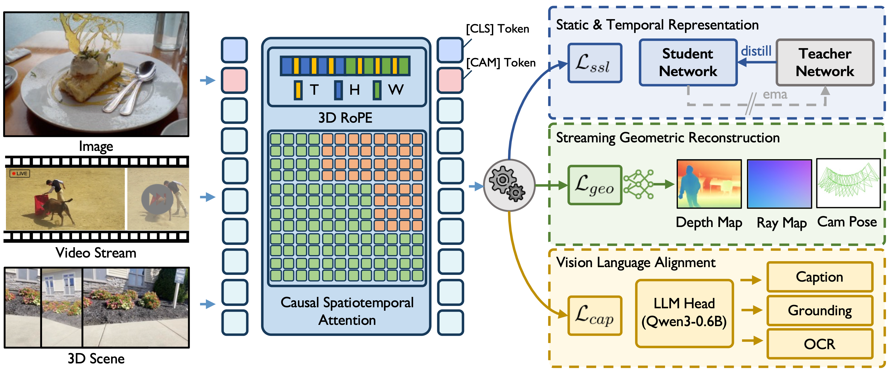

# OmniStream: Mastering Perception, Reconstruction and Action in Continuous Streams
Official implementation of **OmniStream: Mastering Perception, Reconstruction and Action in Continuous Streams**.

[*Yibin Yan**](https://go2heart.github.io/), 
[*Jilan Xu**](https://jazzcharles.github.io/), 
[*Shangzhe Di*](https://dszdsz.cn/), 
[*Haoning Wu*](https://haoningwu3639.github.io/),
[*Weidi Xie*](https://weidixie.github.io/)

(*: equal contribution)

<div style="line-height: 1;">
  <a href="https://go2heart.github.io/omnistream/" target="_blank" style="margin: 2px;">
    
  </a>
  <a href="https://arxiv.org/abs/tbd" target="_blank" style="margin: 2px;">
    
  </a>
  <a href="https://huggingface.co/StreamFormer/OmniStream" target="_blank" style="margin: 2px;">
    
  </a>
</div>

<div align="center">
   
   
</div>

## TODO
- [ ] Release pre-training code.
- [ ] Release our VLM&VLA code.
## Quick Start
### Installation
```bash
git clone https://github.com/Go2Heart/OmniStream.git
cd OmniStream
conda create -n omnistream python=3.10 -y
conda activate omnistream
pip install torch==2.6.0 torchvision==0.21.0 torchaudio==2.6.0 --index-url https://download.pytorch.org/whl/cu124
pip install transformers==4.56.1
```

### Pre-trained Model Usage
We have uploaded our streamformer pre-trained on *Global*-, *Temporal*- and *Spatial*- granularities to [🤗huggingface](https://huggingface.co/StreamFormer/streamformer-timesformer).

#### Inference Usage

```python
from model import OmnistreamMultiFrameTransformer
from transformers import AutoImageProcessor

processor = AutoImageProcessor.from_pretrained("StreamFormer/OmniStream")
model = OmnistreamMultiFrameTransformer.from_pretrained("StreamFormer/OmniStream").to("cuda")

import torch
import numpy as np
model.eval()
fake_pixel = np.random.randn(16, 512, 512, 3) # BxT, H, W, C
fake_input = processor(images=fake_pixel, return_tensors="pt").to("cuda") # BxT, H, W, C
fake_input["pixel_values"] = fake_input["pixel_values"].unsqueeze(0).float() # B, T, H, W, C

with torch.no_grad():
    output = model(**fake_input, return_dict=True)

print(output.keys())
print(output["last_hidden_state"].shape) # last layer's hidden states
print(output["hidden_states"][-1].shape) # last layer's hidden states
print(output["pooler_output"].shape) # cls token
print(output["patch_start_idx"]) # index of the first patch of each frame (1x[cls] + 4x[reg])
```